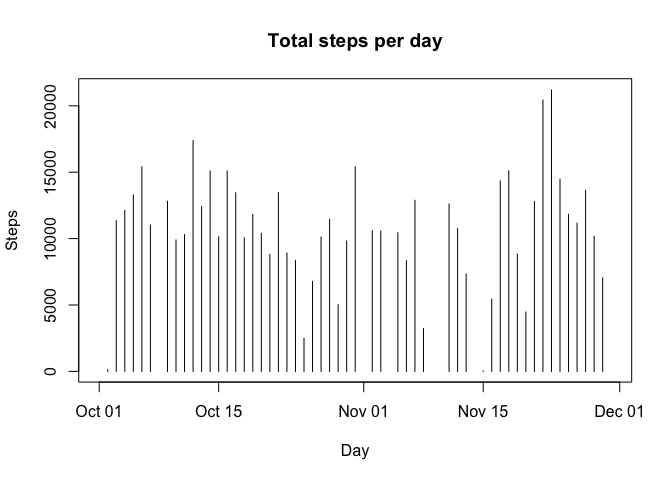
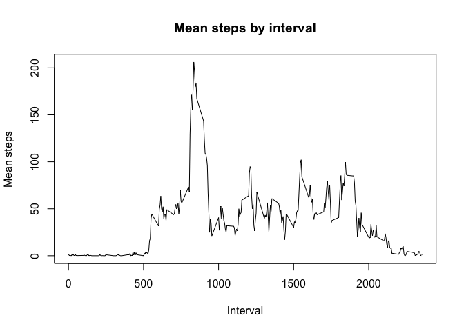
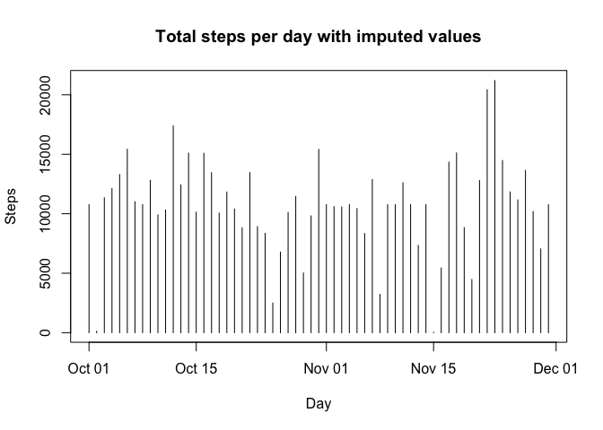
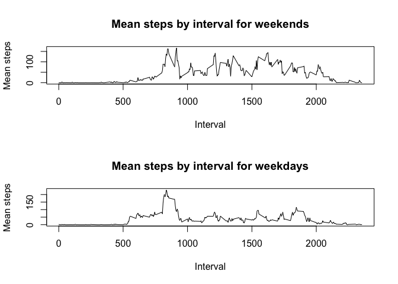

# Reproducible Research: Peer Assessment 1


## Loading and preprocessing the data

```r
activity_df <- read.table(unz("activity.zip", "activity.csv"), sep=",", header=TRUE)
activity_df$date <- as.Date(activity_df$date, "%Y-%m-%d")
```

## What is mean total number of steps taken per day?

```r
library(dplyr)
```

```r
activity_df_by_date <- group_by(activity_df, date) %>%
    summarise(total = sum(steps))
with(activity_df_by_date, plot(date, total, type="h", main = "Total steps per day", ylab = "Steps", xlab = "Day"))
```



```r
mean_activity_by_date = mean(activity_df_by_date$total, na.rm = TRUE)
median_activity_by_date = median(activity_df_by_date$total, na.rm = TRUE)
```

The mean total per day is 1.0766189\times 10^{4} and the median total per day is 10765.

## What is the average daily activity pattern?


```r
activity_df_by_interval <- group_by(activity_df, interval) %>%
    summarise(mean = mean(steps, na.rm = TRUE))
with(activity_df_by_interval, plot(interval, mean, type="l", main = "Mean steps by interval", ylab = "Mean steps", xlab = "Interval"))
```



```r
max_mean = max(activity_df_by_interval$mean)
interval_max_mean = interval_max_mean = (activity_df_by_interval[activity_df_by_interval$mean == max_mean, 1])[[1]]
```

The 5-minute interval, on average across all the days in the dataset, that contains the maximum number of steps is 835, which suggests most stepping activity in the mornings.

## Imputing missing values


```r
activity_df_na <- filter(activity_df, is.na(steps))
```

There are 2304 observations in the data set with an NA value for steps.

We shall impute missing values by using the mean for the interval from all other observations.


```r
activity_df_imputed <- data.frame(steps = integer(), date=as.Date(character()), interval = integer())
for(i in 1:nrow(activity_df)) {
    row <- activity_df[i,]
    if (is.na(row$steps)) {
      row$steps <- (activity_df_by_interval[activity_df_by_interval$interval == row$interval, 2])[[1]]
    }
    activity_df_imputed <- rbind(activity_df_imputed, row)
}

activity_df_imputed_by_date <- group_by(activity_df_imputed, date) %>%
    summarise(total = sum(steps))
with(activity_df_imputed_by_date, plot(date, total, type="h", main = "Total steps per day with imputed values", ylab = "Steps", xlab = "Day"))
```



```r
mean_activity_imputed_by_date = mean(activity_df_imputed_by_date$total, na.rm = TRUE)
median_activity_imputed_by_date = median(activity_df_imputed_by_date$total, na.rm = TRUE)
```

The mean total per day with imputed values is 1.0766189\times 10^{4}, whilst the mean per day without imputed values was 1.0766189\times 10^{4}.
The median total per day with imputed values is 1.0766189\times 10^{4}, whilst the median per day without imputed values was 10765. Since we used the mean to impute the missing values, the mean is not going to change. The median has increased by ~1.

## Are there differences in activity patterns between weekdays and weekends?


```r
dow <- c()
for(i in 1:nrow(activity_df_imputed)) {
    if (weekdays(activity_df_imputed[i,2]) == "Saturday" || weekdays(activity_df_imputed[i,2]) == "Sunday") {
      dow[i] <- "weekend"
    } else {
      dow[i] <- "weekday"
    }
}
activity_df_imputed$dow <- factor(dow)

activity_df_imputed_by_interval <- group_by(activity_df_imputed, interval, dow) %>%
    summarise(mean = mean(steps, na.rm = TRUE))

par(mfrow=c(2,1))
with(filter(activity_df_imputed_by_interval, dow == "weekend"), plot(interval, mean, type="l", main = "Mean steps by interval for weekends", ylab = "Mean steps", xlab = "Interval"))
with(filter(activity_df_imputed_by_interval, dow == "weekday"), plot(interval, mean, type="l", main = "Mean steps by interval for weekdays", ylab = "Mean steps", xlab = "Interval"))
```



The plots above show clear differences between weekday and weekend activity. Weekday activity shows low activity during the day, after the initial peak, compared to weekends, suggesting that the subjects were stationary more often than during the same intervals during weekends. Additionally, the highest mean during weekdays exceeds that of the highest mean during weekends, suggesting fewer steps taken at weekends.
